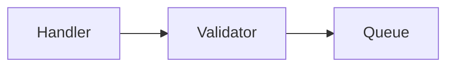

# Design review — September 2026

Written after a few weeks of real use, from a list of problems the user brought
to the session, plus a second agent's review of the work-machine knowledge base
(`learning-conversation-and-feedback`).

**Status: mostly implemented, in 0.13.0.** This document is kept as the
reasoning behind that release — read it before acting on feedback about agent
material, effort, approval, harvesting or crossing machines.

Each recommendation (§2) and each proposed `motivation.md` change (§4) opens
with an **Outcome** paragraph: what shipped, where it lives, and, where it
differs from the proposal, why. The text after it is the proposal as it was
written. Where the two disagree, the outcome is what is true now. Alternatives
dropped before and during implementation are in §3, so they are not
re-litigated.

| Recommendation | Outcome |
|---|---|
| §2.1 agent material | implemented — as `origin: machine`, not a separate kind |
| §2.2 checklists | deferred |
| §2.3 effort, threads, `abandoned` | implemented — threads became `## Open / follow-ups` |
| §2.4 note shapes | implemented, lighter — three shapes inline in `/kb-redact` |
| §2.5 harvesting | implemented — at capture only |
| §2.6 crossing machines | implemented — without a `visibility` key |
| §2.7 durability lane | not implemented — retirement recorded, no key |
| §2.8 `verified` / `approved` | implemented |
| §2.9 quiz fixes | implemented |
| §2.10 hedges | implemented |
| §4 `motivation.md` | §4.2, §4.4, §4.8 in; §4.3, §4.6 added then removed; §4.1, §4.5, §4.7 not done |

Also shipped, and not proposed here:

- **Understanding Cards carry suggested questions** — a machine block in the
  body, written by the agent, drawn on by `/kb-quiz`, never exported.
- **Evidence is recorded once, where it was read.** A note repeats none of its
  captures' evidence, which settles C4's "should a note repeat its capture's
  sources?".
- **`sources` rules are stated as restrictions on derivation, not mention**
  (`frontmatter.md`, "What each kind may take as a source"): naming another
  item in prose is always free.
- **Verification in a fresh context** when the agent explored the same code
  with the user in that session (`kb-common`, Verification) — the operational
  form of C5.

## Symptoms

Roughly twenty-five reported symptoms; eight causes underneath them (§1).

| Reported | Cause |
|---|---|
| agent diagram cannot be captured; re-dictating it is unaffordable | C1 |
| agent's suggestions, feedback and question ideas have nowhere to go | C1, C2 |
| large note stale against new code; update unaffordable | C1, C5 |
| specific → generic has too much friction | C1, C8 |
| should the agent fill in paths in a diagram? | C1 |
| may an agent-written takeaway be admitted? | C1 |
| capture too slow for flows and relationships | C1, C3 |
| redaction needs several rounds; notes not scannable | C3 |
| dictation is linear, the right shape often is not | C3 |
| diagrams need heavy guidance to come out right | C3 |
| `/kb-update` appended instead of integrating | C3 |
| notes follow the train of thought, not the code | C3, C4 |
| capture↔note cardinality; facts from combining notes | C4 |
| same-type sources; consolidating captures | C4 |
| note without a capture; card without a note | C4 |
| should a note repeat its capture's sources? | C4 |
| time; every answer raises two follow-ups | C2 |
| backlog: unredacted, uncarded, unchecked, todos in a stray file | C2 |
| agent-moderated exercises would take too much time | C2 |
| quiz scope: widen or stay? asked inconsistently | C2 |
| quiz questions unanswerable in a short phrase | C2 (+ §2.9) |
| quizzes measuring recognition (4/4 on multiple choice) | C2 (+ §2.9) |
| recall is not enough; understanding cards too constraining | C6 |
| corpus is all plumbing; nothing on the language or framework | C6 |
| everything is reading, nothing is writing | C6 |
| hedges in dictation | — (§2.10) |
| `verified` means two things | C7 |
| switching machines to record a pattern | C8 |

## 1. Diagnosis

Describes the system as of 0.12.0: the `kb-common` rule quoted in C1, the
`inbox/inbox.md` in C2 and the overloaded `verified` in C7 are all gone.

### C1. The articulation rule is doing two jobs

`motivation.md` §1.3 already provides for agent-written material —
*"not prohibited in principle: the requirement is to keep it mechanically
separable"* — but the skills implement a much stronger rule (`kb-common`:
**NEVER add new information to items with human origin**), and `origin: machine`
exists in the schema while nothing but a quiz log uses it. The escape hatch was
designed and never built.

Two different things are being conflated:

- **Claims** — causation, consequence, why, tradeoffs. These must be the user's.
  This is the real rule and it should stay absolute.
- **Scaffolding** — identifiers, paths, call order, which file calls what, the
  topology of a diagram. This is transcription *of the code*, not composition of
  knowledge, and an agent supplying it takes nothing from the user.

Everything the system currently cannot do with agent material follows: an
agent-drawn diagram cannot be kept, a delta report against changed code cannot
be acted on without re-dictating the whole note, a named pattern cannot be
recorded without re-deriving it, and the agent's suggestions and question ideas
have nowhere to go at all.

### C2. Nothing in the system can say "not now" or "never"

Every item the pipeline produces is an obligation, and nothing is ever closed
except by completing it. There is no stopping rule anywhere: not in
exploration (hence follow-ups multiplying faster than they can be answered),
not in capture, not in redaction, not in the backlog.

The observable result is the current state — captures unredacted, notes
uncarded, freshness unchecked, and an improvised `inbox/inbox.md` holding todos
the format has no place for. The second agent read the same thing off the work
base and called it correctly: the backlog is a signal, not a debt.

**This is the cause behind the user's stated biggest problem (time).** Time
pressure is not fixed by working faster; it is fixed by being allowed to stop.

### C3. Structure is decided last, and that is also why updates append

Dictation is linear; the right shape for the result is frequently not — a table,
a nested list, a diagram. Redaction is therefore asked to reverse-engineer the
structure the user would have chosen, and it gets it wrong, and every correction
arrives *after* the prose exists and costs a rewrite. Hence the several rounds
of feedback per note.

The same cause explains a separate complaint: `/kb-update` appends instead of
integrating. A note with no visible structure is a sequence of paragraphs, and a
sequence has exactly one safe insertion point — the end. The agent is also under
a rule not to alter the user's claims, which makes rewriting the surrounding
paragraph feel prohibited even where it is not.

### C4. The chain is session-shaped; knowledge is subject-shaped

The pipeline is a conveyor: one dictation, one capture, one note, its cards.
Notes therefore inherit the shape of the exploration that produced them rather
than the shape of the subject, which is the "chaotic notes" complaint.

The cardinality questions all come from here — whether a note may draw on
several captures, whether a card may cite two notes, whether captures may be
consolidated, whether a note may exist without a capture, whether a note repeats
its capture's sources.

### C5. Capture and redaction are in different sessions, deliberately

Redaction is put off to the next day on purpose, and it works: the delay is
itself a retrieval exercise. The design must therefore assume **no shared
session context**, which means anything the redactor needs has to be in files.

There is a second, sharper reason not to do both in one session:
**verification by the agent that produced the answer is circular.** In a work
session the agent holds the code in context and has already formed a view; when
the user dictates a claim, it checks that claim against the same context that
generated it, and fills gaps from what it knows rather than from what was said.
That is structural, and no prompt fixes it.

### C6. The corpus is not aimed at the stated bottleneck

The second agent's finding, and the most uncomfortable one: every item in the
work base is project plumbing. Nothing on the language, nothing on the framework
whose execution model makes the code look strange. The capture trigger is
*stumbling under work pressure*, so what gets captured is whatever was in the
way — which is a structural bias, not an accident, and it is predictable enough
to be worth naming in the design.

Two further parts of the same cause:

- **Part of the felt problem is skill, not propositions.** No card drills "read a
  signature and judge whether it is honest." The user reached the same
  conclusion independently — *"recall is not enough… even understanding cards
  seem too constraining"* — and had nowhere to put it. The system is not failing
  here; it is being asked for something outside its scope, and the scope is not
  written down plainly enough to prevent the misattribution.
- **Everything enters by reading.** Reading code, reviewing a merge request.
  Cheaper routes to the same understanding exist and are compatible with voice
  input; nothing in the design mentions them.

### C7. `verified` is overloaded

From the machine it means fact-checked; from the human it means approved. Two
different acts sharing one key, which makes eligibility rules downstream awkward
and would make the machine-origin layer of C1 harder to gate.

### C8. The two-machine split is solved at the wrong time and place

A generic pattern spotted in client code currently has to be re-derived at home,
without the example, in front of a verifier that cannot see what is being talked
about — so its questions are ungrounded and the whole thing is expensive enough
to skip. Reformulation is not inherently costly; it is costly *after* the
context is gone.

The binding constraint is egress: nothing may be pushed from the work machine to
private storage. Bringing the private base the other way is possible but carries
the IP exposure, and is not needed.

## 2. Recommendations

### 2.1 Companion items, and marked regions in notes

**Outcome: implemented, but the companion is not a separate kind.** At the raw
layer agent material is a `Capture` with `origin: machine` (the kind was
renamed from `Raw Capture`); inside notes and Understanding Cards it is a
machine block, which `kb_check.py` checks for opening and closing. The
argument below for a distinct kind was rejected: every skill that could
confuse the two already has to read `origin`, since nothing machine-origin is
carded wherever it sits, so a second kind would be a duplicate switch to keep
in step. `/kb-redact` reads `origin`. The no-conversion rule and the
origin-over-kind choice are in `decisions.md` §6. Not implemented: the "where
genuinely unclear, default to machine" rule. Lives in `frontmatter.md`
(Machine blocks; Capture), `kb-common` (Claims and scaffolding), `/kb-capture`
step 5.

The load-bearing change. Machine material becomes real, with one invariant:

> **Machine-origin material never produces a card, and never states a claim in
> the user's name.**

It lives in a different place at each layer, because fragmentation costs
different amounts:

| Layer | Machine material lives | Why |
|---|---|---|
| raw | a **separate companion item** | the raw layer is a journal, rarely re-read; file-level separation is the strongest kind, and a mixed file would make its own `origin:` key false |
| note | **marked regions inside the note** | this is where the user reads for understanding; a scavenger hunt across three files is not acceptable |

A marked region, invisible when rendered and unambiguous to a parser:

````markdown
<!-- machine: claude-code/opus-5, 2026-09-12, commit a1b2c3d -->

<!-- /machine -->
````

No card may be drawn from inside one; the quiz may ask about one; `/kb-update`
may regenerate one freely, since a diagram redrawn against new code is
scaffolding and needs no ceremony. The file keeps `origin: human`, because its
claims are still the user's.

**The companion is a distinct kind, not a `Raw Capture` with `origin: machine`.**
The latter is more elegant and has one concrete failure: `/kb-redact` would
conflate companions with actual human captures and
redact agent prose as though it were the user's words. The principled version of
the same argument is that the attached rules genuinely differ — never carded,
freely rewritten, never approved, never the thing a card traces to.

The companion earns its place three times: it holds the diagrams and reports, it
holds the agent's suggestions and open questions, and it is **durable session
context** for the next-day redactor — better than the real thing, because it is
curated and still there a week later.

**How origin is decided in practice:** it is not a judgement. The user spoke it
⇒ human; the agent read it off the code ⇒ machine; the skill that writes it
already knows which. The only decision point is the agent *offering* ("shall I
diagram this?"), and accepting produces a companion. Where genuinely unclear,
default to machine: the costs are asymmetric — machine material is merely
excluded from carding and the quiz can convert it later, whereas human-origin
material that is not really the user's gets drilled into memory as though it
were, which is the failure `motivation.md` exists to prevent.

**Conversion is not an operation.** Machine text never becomes human text. What
happens instead is that the user answers a question about it, and **the claim
they state in answering is theirs**, recorded normally through
`/kb-capture` or `/kb-update`. The machine region stays as it is, correctly
labelled, and the note grows human claims beside it. This removes a decision
that would otherwise have to be made per item, and it closes the only real
hazard — reading agent prose, thinking "yes, exactly", and mistaking that for
knowledge.

### 2.2 Checklists offered, not declared

**Outcome: deferred** (`deferred.md`). This is working-session behaviour, not
knowledge-base design, and needs no mechanism. Revisit when the recorded open
items turn out to be mostly unanswered checklist questions.

Naming the shape of a task converts open-ended tracing into a few closed
questions — *"this threads one field end to end: is it minted at exactly one
origin, does it survive each hop unmodified, what does absent mean, is it
written atomically with what it describes"*. That is a **stopping rule**, and
the absence of one is C2.

The agent infers the shape from what is being done and **offers** the checklist;
the user never declares anything. Zero added friction. The checklist lands in
the companion item, so the next-day redactor can see which questions were
answered and which are still open — and the open ones become threads instead of
disappearing.

### 2.3 Effort as a parameter, threads, and `abandoned`

**Outcome: implemented, with threads replaced.**

- **Effort** is one table in `kb-common` with rows for verifying, capture,
  redact, cards and update. `/kb-quiz` keeps its own three modes, which set
  answer length rather than amount of work. The default is **`normal`, not
  `quick`**.
- **Threads are not a kind.** Every skill writes what it skipped under
  `## Open / follow-ups` in the machine-origin capture for the subject,
  creating that capture if needed, and never in the note, because the note is
  what the user reads for understanding. A `<kb>/open.md` for items with no
  subject was tried and dropped: it reinvented the stray `inbox/inbox.md` of
  C2, with no format behind it.
- **`abandoned`** is in the schema and in `kb_check.py`. `kb-common` names what
  it is for (a capture that will not be redacted, a follow-up not worth
  pursuing) and says to ask before stamping it.

Three parts of one mechanism against C2.

**Effort** is already half-present — `/kb-quiz` has quick/normal/detailed, and
capture and update have a "quick" magic word. Make it uniform, and make it mean
*breadth and depth of work, never quality of work*:

| Skill | quick | normal | thorough |
|---|---|---|---|
| capture | no verification, record `commit` only | verify the load-bearing claims | verify everything, follow the code paths |
| redact | promote or minimally compress, one item, no outline step | one item, outline-then-fill | consolidate several captures into a subject note |
| cards | the one or two obvious facts | full sweep of the note | plus cross-note cards and an understanding card |
| update | raw append only, stop | fold into the note | note, cards, and sibling notes checked for contradiction |

**Threads** are a first-class item: an open question, a pattern to extract, a
"check this later", attached to a subject. `origin: machine` is allowed and
expected — this is where the agent's suggestions and quiz-question ideas go
without violating anything, and it is what `inbox/inbox.md` is currently
improvising.

**`status: abandoned`** makes deciding *not* to pursue something a recordable
outcome. Without it the backlog is a pile of unresolved guilt rather than a list
of live decisions, and the user stops looking at it.

**What ties the three together: the default is `quick`, and every run reports
what it skipped, as threads.** Low effort then stops being a loss — the skipped
work is written down instead of forgotten, and nothing is ever an unpayable
debt.

### 2.4 Note shapes, kept light

**Outcome: implemented, lighter.** Outline-then-fill is `/kb-redact` step 3,
skipped at quick effort. Three shapes are named inline there (flow,
comparison, gotcha); there is no `reference/note-shapes.md`, and rules and
anatomy were left out. The anti-appending self-check, and "reordering and
rewording is not altering", are `/kb-update` step 5; "claims are theirs,
shape is yours" is `/kb-redact` step 2.

A short `reference/note-shapes.md` giving the agent good defaults for what each
kind of section should contain, used as **the vocabulary it proposes an outline
in** — and nothing else. No frontmatter markers, no enforced completeness
checks, no schema.

Shapes are **per section, not per note**: a single note may hold a flow diagram,
then a comparison table, then a few bullet takeaways.

- **flow** — the trigger; ordered steps with real identifiers; decision points
  *and their conditions*; terminal states including failures; and the invariant
  (what is true at the end that was not true at the start). Mermaid for topology
  plus a numbered list for detail — both, not either. Topology and identifiers
  are scaffolding; the invariant is a claim and must be the user's.
- **comparison** — the axis being compared (the part usually left out), the
  subjects, the rows, and the choosing rule ("use A when…").
- **rules** — the rule, its scope qualifier, the reason, the exceptions.
- **anatomy** — the parts, what each owns in a sentence, the boundaries, where
  the surprising things live. This is the shape for learning an unfamiliar
  codebase.
- **gotcha** — the symptom as observed, *the wrong mental model that made it
  surprising*, the actual cause, the fix, and what class it generalises to.

Unshaped prose stays a legitimate section. A vocabulary that has to cover
everything becomes bureaucracy.

**Redaction becomes outline-then-fill:** propose only the skeleton first —
headings, "this becomes a table with these three columns", "these five steps
become a flow" — take twenty seconds of correction, then write. Nearly all of
the current feedback rounds are about shape, and correcting shape after the
prose exists costs a rewrite each time.

**And one instruction plus one self-check fixes the appending:** the note must
read as though written fresh today; after folding an update in, re-read the
whole note and ask whether it reads as one document or as a document with a
postscript. Reordering and rewording the user's own claims is not altering them;
dropping or adding one is.

### 2.5 Harvesting the general pattern

**Outcome: implemented, differently in three places.** The rule is stated once
in `kb-common` ("The general pattern"); `/kb-capture` step 6 does the
suggesting, at normal or thorough effort, once per capture, and a declined
suggestion goes under `## Open / follow-ups` and is not raised again.

- **At capture only, not at redaction.** At capture time the user and the
  agent still have the example in front of them; by next-day redaction that
  context is gone, which is C8's diagnosis applied to this mechanism.
- **No transfer block and no constructed example.** The user's sentence
  becomes an ordinary capture, verified like any other; which example to use
  is left to the agent.
- **The harvested capture does not take the specific capture as a source.** A
  human-origin capture takes evidence only, and the pattern has evidence of
  its own on either machine: the code it was seen in at work, and an example
  the agent can see at home.

The pattern is usually *present and unnamed*, and the agent can usually see it.
So the harvest is the mechanism of §2.1 pointed at generality instead of at a
diagram:

1. **The agent proposes** candidate patterns at the end of working on the
   specific thing — a prompt, not content, recorded in the companion item.
2. **The user articulates it briefly** — two or three sentences, with the
   example still on screen. *"Four same-typed positional parameters in a row
   means the compiler cannot catch a swap, and every reader has to go look at
   the definition."* Fifteen seconds of dictation.
3. **The agent writes a transfer block** from those words: sanitised,
   self-contained, deliberately small, plus a constructed public example.

One rule covers both this and the quiz: **the agent may point; the user
articulates; the user's words are what is kept.**

### 2.6 Crossing the machine boundary

**Outcome: implemented minimally, as part of harvesting** (`kb-common`,
"Crossing to the private base"). A pattern crosses as text, read aloud or
retyped. It is written to cross from the start: self-contained, naming no
client repository, path, identifier or term, and checked on the work machine.
On the private side it is an ordinary dictation, verified against an example
the agent can see there; if there is none it stays unverified (`status:
draft`). That replaces the opaque source below with a state that already
existed. **The `visibility` key and a mechanical sanitisation check are
deferred** (`deferred.md`): only a harvested pattern crosses, and it is
written to cross, so there is nothing else to label.

With no egress, the transfer is human-mediated, so the design goal is to make
what crosses **small enough that any channel works** — including reading it
aloud into the private laptop's dictation. That is achievable precisely because
the expensive part was never the typing but the re-derivation, and §2.5 moves
the re-derivation to where the example is.

- `visibility: private | shareable` on every item in the work base.
- The sanitisation check runs on the work machine, where it can actually verify
  that no client repo, path or identifier is named.
- **A generic pattern has public examples**, so the private-side agent verifies
  against one of those rather than against code it cannot see. That fixes the
  ungrounded-questions problem properly. If a pattern cannot be re-grounded
  publicly, that is useful signal: it is probably not generic yet, and should
  stay a work-base note.
- A source may be **opaque** — verified on the work machine, evidence withheld —
  as the fallback where public re-grounding fails.

### 2.7 The durability lane

**Outcome: not implemented as lanes.** A `scope: general | project` key
shipped briefly and was dropped. Whether an item is project knowledge is
legible from its sources, so a key would be a second copy of that fact. A
`/kb-cards` default of "project items get only an Understanding Card" went
with it. Kept: retirement as an idea, in `motivation.md` §1.1 and in
`deferred.md` (at project exit, suspend the cards whose source chain ends in
that repository). `stale_after` is still part of the deferred revalidation.

Project knowledge is worth memorising, but **for the duration of the
engagement, not forever**. Making that explicit settles several things at once:

- **Concept lane** — no `stale_after`, full card treatment. This is what
  transfers to the next codebase, and it is currently almost absent from the
  corpus (C6).
- **Plumbing lane** — short `stale_after`, cards legitimate but **retired at
  project exit rather than maintained**.
- A plumbing capture that sat six weeks without becoming a card has probably
  already done its job. Letting it go is the correct outcome, not a failure, and
  `abandoned` records it without ceremony.

### 2.8 Split `verified` and `approved`

**Outcome: implemented.** `approved: {by, at}` is human-only, enforced by
`kb_check.py`. Cards carry `approved` and no `verified`; card eligibility is
`approved`. `kb_export.py` also accepts a legacy `human:` entry in `verified`
as approval. One addition: a capture the user cards directly gets `approved`
stamped at that point, because asking for the cards is the approval.

- `verified: [{by, at}]` — fact-checked against evidence.
- `approved: {by, at}` — human only: this is mine, worded right, worth keeping.

Machine approval never occurs, and an asymmetric key is the honest way to say
so. The payoff is downstream: `/kb-cards` eligibility becomes "approved", which
by construction excludes the whole machine layer without a second rule saying
so.

### 2.9 Two small fixes to `/kb-quiz`

**Outcome: implemented** in `/kb-quiz`: the expected answer is written first
(step 3). Quick mode recommends one grade lower than the score suggests
(step 5) — the conservative-grade option, rather than restricting it to recall
cards.

- **Short-phrase questions.** The agent cannot check a question against a length
  constraint, because it is evaluating the question and the constraint is on the
  answer. Make it generative: write the expected answer *first*, and discard the
  question if that answer exceeds the mode's length.
- **Quick mode is inflating grades.** Four-for-four on multiple choice, over
  notes the user wrote, measures recognition. Restrict quick mode to recall
  cards, or have it propose a deliberately conservative grade.

### 2.10 Hedges stay

**Outcome: implemented.** Hedges are kept at capture (`/kb-capture` step 1),
checked first at normal effort (`kb-common` effort table), and dropped at
redaction once verification settles them (`/kb-redact` step 2).

"Probably", "I think" should not be stripped at capture. They mark exactly where
verification should look first, and where a card is most valuable — an uncertain
belief that turns out true is worth drilling, and one that turns out false is
the highest-value signal the pipeline produces. Capture keeps the words,
verification prioritises them and reports back, redaction drops them as it does
today.

## 3. Considered and dropped

- **Task shapes declared by the user.** Adds friction at exactly the wrong
  moment, and the agent can read the shape off the work. Kept as an inference
  the agent makes and offers (§2.2).
- **A separate "practice loop" beside the pipeline.** Its proposed success
  condition ("you were wrong, now you are not") missed the commonest case: *"I
  did not understand something, and now I do"* — which is what the existing
  pipeline is already for. What predict-then-run and break-and-read actually are
  is cheaper ways to spend the exploration phase, so they are guidance (§4.5),
  not architecture.
- **Shape markers in frontmatter or as HTML comments.** A note that visibly
  contains a table is recognisably a comparison without a marker saying so. The
  anti-appending fix does not need them (§2.4).
- **Completeness tests as enforcement.** Schema where guidance does the job.
- **Machine-origin items converted to human-origin.** Replaced by: no conversion
  exists, and the claim stated in response is the user's (§2.1). Removes a
  per-item decision entirely.
- **Copying the private base onto the work machine.** Possible, unnecessary, and
  the direction that carries the IP exposure.

Dropped during implementation — reasons in the outcome notes referenced:

- **A separate kind for agent captures** — `origin` already carries it (§2.1).
- **Threads as a kind, and `<kb>/open.md`** — `## Open / follow-ups` in the
  machine-origin capture instead (§2.3).
- **A `scope` key, and lanes** — legible from sources (§2.7).
- **Harvesting at redaction** — the example is gone by then (§2.5).
- **A harvested pattern taking its specific capture as a source** — it has
  evidence of its own (§2.5).
- **The independence subsection and the sixth obligation in `motivation.md`**
  — not useful there, and did not earn their place (§4.3, §4.6).

## 4. Proposed changes to `motivation.md`

### 4.1 §1.2 — voice is a constraint, not a preference

**Outcome: not implemented.** §1.2 still opens with the friction argument.

The current text reads as a friction argument. It is stronger than that, and the
design leans on it repeatedly (it is why writing code is not an available
exercise, and why anything requiring typed structure is not a fix). Replace the
opening sentence of §1.2:

> Knowledge enters by voice, and not by preference: typing is limited by a hand
> injury, so any design that asks for typed structure — code, tables, careful
> markup — is asking for something that will not happen at the moment learning
> does.

### 4.2 §1.3 — draw the claims / scaffolding line

**Outcome: implemented as written.**

Replace the final paragraph of §1.3 ("Agent-written material is not prohibited
in principle…") with:

> Agent-written material is not prohibited in principle, but the line has to be
> drawn in the right place. **Claims** — causation, consequence, why, tradeoffs,
> what follows from what — must be the user's, always. **Scaffolding** —
> identifiers, paths, call order, the topology of a diagram — is transcription
> of the source, not composition of knowledge, and an agent supplying it takes
> nothing from the user.
>
> So agent material is kept, mechanically separable, and never carded. The route
> out of it is not approval: reading a paragraph and agreeing with it is the
> illusion of understanding, which is what §1.3 is about. The route is a
> question — **the claim the user states in answering is theirs**, whatever
> prompted it, and it enters the way any other articulation does.

### 4.3 §1 — a new subsection on independence of checks

**Outcome: added, then removed by the user** — not useful in `motivation.md`,
at least not in that place. The operational rule survives in `kb-common`
(Verification): when the agent explored the code with the user in the same
session, it verifies in a fresh context.

Add after §1.3:

> ### 1.4 A check is only worth what its independence is worth
>
> Verification by the agent that just produced the answer is not verification.
> Inside a working session the agent holds the source in context and has already
> formed a view; asked to check a claim, it checks against the same context that
> produced the claim, and fills gaps from what it knows rather than from what
> was said. The check has to be made later, or elsewhere, by something that has
> to go and look.
>
> This is also why deferring redaction to the following day is not only a
> concession to time: the delay makes the check independent, and the retrieval
> it forces is worth having on its own.

### 4.4 §1 — a new subsection on what the trigger selects for

**Outcome: implemented, shortened, as §1.4** (renumbered after §4.3 was
removed). It is the stated reason for harvesting (§2.5).

Add after the above:

> ### 1.5 The corpus drifts toward whatever the trigger catches
>
> Capture fires on stumbling under work pressure, so what accumulates is
> whatever was in the way — which on an unfamiliar codebase is plumbing: what
> this argument is for, where this value goes. The knowledge that would have
> made the stumble unlikely in the first place — the language, the framework's
> execution model — is never what one is stuck on, and so is never captured.
>
> The bias is structural and predictable, so the system must correct for it
> rather than hope: underneath most project-specific stumbles is a general item,
> and it is cheapest to name at that moment, with the instance still on screen.

### 4.5 §1 — a new subsection on where articulation comes from

**Outcome: not implemented.** The routes below are recorded as a deferred
drill skill (`deferred.md`): any session with an agent can run them on
request, and a skill earns its place only if the history across sessions
matters.

Add after the above. **This is the part covering the new learning modes.**

> ### 1.6 Articulation has to come from somewhere
>
> The system takes articulation as its input and says nothing about what
> produces it. In practice one route has been used — read the code, trace it,
> reach a conclusion — and it is the most expensive one available, it scales
> badly with unfamiliarity, and it terminates in a conclusion nobody checks.
>
> Cheaper routes exist, and all of them are compatible with voice:
>
> - **Predict, then run.** State a consequence out loud; the agent makes the
>   change and runs it. The learning value of writing code was never the
>   typing — it was committing to a prediction and being corrected — and that
>   part survives without a keyboard.
> - **Break and read.** The agent introduces a deliberate error; the user reads
>   the compiler or test output and says what it means and which layer it is in.
>   Pure reading and speaking.
> - **Specify, then diff.** The user dictates what a function must do; the agent
>   writes it; the user reviews the diff against their own spec. Unlike
>   reviewing someone else's change, the intent is the user's, so a mismatch
>   locates their own model's error precisely.
> - **Answer for the scaffolding.** The agent draws the diagram or writes the
>   walkthrough (§1.3) and then asks about it. The answer is the articulation,
>   and the scaffolding is what makes it answerable months later.
> - **Enter at the cheap boundary.** Some structures are readable at one
>   deliberately-chosen place instead of by tracing — consumer-declared
>   interfaces, wiring assembled in one function, a well-commented type. Reading
>   those once, on purpose, is worth many traces.
>
> A prediction that comes out right teaches nothing and should be captured as
> nothing. A prediction that comes out wrong is the most valuable capture
> available: surprising by definition, and the user's own by definition.

### 4.6 §2 — a sixth obligation

**Outcome: the obligation was added, then removed by the user — it did not
earn its place.** `motivation.md` has five obligations. The success-criterion
extension below is still in.

Add to the obligations table, and note that it is orthogonal to the others —
it governs how much of them happens:

> | **Bound** | able to stop, defer and abandon | a backlog that grows until the system is abandoned |

And extend the success criterion:

> **Success criterion.** The user can answer questions about things they learned
> several months earlier, understands a codebase they no longer actively
> develop, is not drilled on anything that has become false — and is still using
> the system, because it never demanded more of a week than was in it.

### 4.7 §2 — scope, sharpened

**Outcome: not implemented.** The scope paragraph in `motivation.md` §2 is
unchanged.

The current scope paragraph settles recall versus lookup. It should also settle
skill, because the misattribution is live: part of the felt difficulty with an
unfamiliar codebase is a skill — reading a signature and judging whether it is
honest — and skills are not propositions, so no card can drill one. Append:

> Skill is out of scope as *content*: what the system stores is propositions,
> and "read a signature and judge whether it is honest" is not one. It is in
> scope as *method* — the routes in §1.6 build skill as a side effect of
> producing articulation, and that is the only claim made here. Continued
> difficulty at a skill is not evidence that the knowledge base is
> underperforming.

### 4.8 §1.1 — retirement, not only staleness

**Outcome: implemented**, with one sentence added: which of the two an item is
needs no label, because it is legible in the sources it was checked against
(see §2.7).

§1.1 concludes that the system must own the problem of knowledge going stale.
Add the cheaper half:

> Project knowledge is worth memorising for the duration of the engagement, not
> for ever. That makes retirement, not revalidation, the right answer for most
> of it: its cards are retired when the project is left, rather than maintained
> against a codebase nobody is reading any more. Revalidation is for what
> outlives the project.

## 5. Notes for the other documents

**Outcome: all three done.** `deferred.md` has the collapsed wiki entry and
retirement, keyed on the source chain rather than a key; `decisions.md` §6
records the fence, the no-conversion rule, and `origin` over a separate kind.

- **`deferred.md` — the wiki entry collapses.** Synthesis across notes is
  machine-origin material at corpus scale: same invariant (never carded, the
  quiz converts it), wider scope. The entry's stated blocker, *"telling
  reorganisation from genuine synthesis"*, is answered by the per-sentence test
  — can the user point at what they said that it came from? Reorganising the
  user's own claims across notes is then just what the note layer should always
  have allowed (C4), and is not the wiki at all.
- **`deferred.md` — revalidation gains a cheaper sibling**, retirement (§4.8),
  which needs no change detection at all.
- **`decisions.md`** — if the companion kind and the no-conversion rule are
  adopted, both belong there rather than here, as they are boundary decisions
  that will otherwise be re-argued.

## 6. Sequencing

**Outcome: moot.** Everything implemented shipped together in 0.13.0. The
order below was the proposal.

1. **§2.3** — effort, threads, `abandoned`. Mostly prose in the skills, and it
   relieves the pressure that makes everything else feel expensive.
2. **§2.1** — companion items and marked regions. The load-bearing change;
   everything about diagrams, updates and harvesting waits on it.
3. **§2.2** and **§2.4** — checklists offered, and outline-then-fill with the
   shape vocabulary. Both are guidance, both are felt within a session.
4. **§2.8**, **§2.9**, **§2.10** — mechanical, shallow, independent.
5. **§2.5** and **§2.6** — harvesting and the transfer block, once §2.1 exists.
6. **§2.7** — the durability lane, which wants `stale_after` from `deferred.md`.
