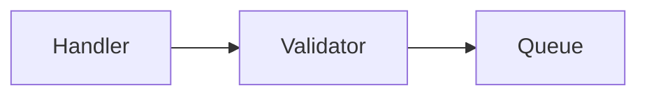

# Knowledge base frontmatter

The one description of the file format. Every other place that needs it — the
skills, the copy at `SCHEMA.md` in the knowledge base — either injects this file
or points at it. `scripts/kb_check.py` enforces it.

This describes frontmatter, plus the one body convention that carries meaning
(machine blocks, below). Where a file lives is not part of the format: the
directory names in the examples are illustrative, and the knowledge base is
free to be arranged any way.

## Identity

An ID takes one of two forms, chosen by whether the item ever leaves the base:

| Scope | ID form | Example |
|---|---|---|
| stays in the base (capture, note) | `<slug>_<n>` | `retry-wrapper_1` |
| leaves the base (e.g. a card) | 12 random base62 characters | `Xo1jycAlN4xQ` |

`<n>` is the lowest number free among items already sharing that slug — kind
is not part of identity, so a capture and the note made from it share one
pool: a capture is usually `_1`, the note made from it `_2`.

Random IDs are drawn with `scripts/kb_randomid.sh [count]`, never invented.
Twelve base62 characters is 62^12 ≈ 3.2×10²¹ possible values, so collisions
stay unlikely even at scale: with ten million already drawn, the chance any
two of them collide is still only about one in 64 million.

**Filenames.** The filename must contain the full ID, and may carry a prefix
ahead of it, underscore-separated — a date, another slug, whatever helps
browsing. E.g. `2026-08-10_retry-wrapper_1.md`, `retry-wrapper_Xo1jycAlN4xQ.md`.
The ID is repeated in frontmatter so a moved or renamed file stays
identifiable.

## Common keys

Present on every item:

```yaml
id: retry-wrapper_2
type: Note        # kinds in use: Capture, Note, Recall Card,
                  # Understanding Card, Quiz Log; not a closed set
title: Retry wrapper ordering    # required on every item, cards included
origin: human                    # human | machine
generated: { by: claude-code/opus-5, at: 2026-08-10T14:35:00Z }
status: stable                   # draft | stable | deprecated | abandoned
```

`origin` says **whose claims these are**, and is never inferred: `human` means
the content asserts what the user asserted. It is a different question from
`generated.by`, which records who produced the *text* — a polished note is
written by the agent and still carries `origin: human`. `machine` is the mirror
image: material whose claims are not the user's, however it was produced.
**Machine-origin material never produces a card.** It is also what tells two
items of the same `type` apart — a dictated capture from one the agent wrote
beside it — so no kind is duplicated to carry the distinction.

`status`: `draft` until verified (and, for a note or card, approved);
`deprecated` when it has stopped being true; `abandoned` when the user has
decided not to pursue it — a recorded decision, never a deletion.

`generated.at` marks the content's **last meaningful change**, not when the
file was first written: appending an update to an item moves it. Read against
`verified`, that is what says whether an item has changed since it was last
checked — a `generated.at` later than the last `verified.at` means it has — and
a derived item whose `generated.at` is older than its source's is behind it.

Actors follow OKF §7: `human:jan`, `claude-code/opus-5`, `process:export`. The
ones in this file are illustrative: take the human actor from the `user:` the
bearings report and the machine actor from your own model ID, never from an
example here.
Timestamps are UTC, ISO 8601 — `date -u +%Y-%m-%dT%H:%M:%SZ` produces them.

## `verified` and `approved`

Two different acts, two keys. **`verified`**, a list of `{ by, at }`: the
claims were checked against evidence — normally the agent's entries.
**`approved`**, a single `{ by, at }`, human only: this is mine, worded right,
worth keeping — stamped at the user's say-so and never on their behalf, and
what makes an item eligible for cards. A note or card carries one; so does a
capture the user chooses to card directly, where the asking is the approval.
A `human:` entry in `verified` on an item written before the split reads as
approval.

**Unverified means draft**, for everything. That is the one rule
`kb_check.py` enforces about meaning; the rest of what it checks is shape —
required keys, timestamps that parse, an `id` the filename contains, machine
blocks that close.

## `sources`

Every entry carries `resource`; the rest are optional. A leading `/` makes it
base-relative — that is how an item points at another item in the same knowledge
base.

```yaml
sources:
  - resource: /raw/2026-08-10_retry-wrapper_1.md   # another item in this base
  - resource: https://github.com/acme/backend    # repository
    path: src/queue/retry.py                     # or paths: [a.py, b.py]
    symbol: RetryWrapper                         # optional; or symbols: [...]
    commit: a1b2c3d                              # what it was verified against
  - resource: https://peps.python.org/pep-0492/  # document
    author: human:gvanrossum                     # only if the source names one
    retrieved: 2026-08-10
```

A repository is named by URL, never by a local path: where the checkout sits is
machine-local, so an item naming it would be false on the next machine — and an
item survives the checkout moving precisely because it never named the place.
`path` is relative to the root of the repository named by `resource`, never to
the working directory the item was written from. `path` and `symbol` each have a
plural form taking a list; use whichever fits what verification actually
touched, never both forms of the same key in one entry.

`commit` and `retrieved` record *what the claim was checked against* and are
written at capture — revalidation reads them, and they cannot be recovered
once the verifying context is gone.

The **first** sources of a derived item are the items it was derived from — a
note takes its captures as sources. That link is what marks the original as
processed. **Evidence is recorded once, where it was read**: a note repeats
none of its captures' evidence, and lists only what it was itself checked
against beyond them. Revalidation follows the chain.

What each kind may take as a source:

| Item | Sources |
|---|---|
| Capture, `origin: human` | evidence only — never another capture; the raw layer is the log, and consolidation happens in notes |
| Capture, `origin: machine` | the capture it accompanies, if any, then evidence |
| Note | one or more captures and notes; then evidence read beyond them |
| Card | notes or captures in this base — never a repository or a document directly, so that staleness reaches a card through the chain |
| Quiz Log | every note quizzed |

**These are restrictions on `sources`, not on mentioning.** A source says this
item was derived from that one, or checked against it, and is the link every
downstream pass follows. Naming another item in prose is always free: those
mentions are decorative and are not maintained. Frontmatter is authoritative.

## Machine blocks

Inside an `origin: human` item, agent-written material lives in a **machine
block**: a fenced region invisible when rendered and unambiguous to a parser,
carrying who wrote it, when, and the commit it was read at.

````markdown
<!-- machine: claude-code/opus-5, 2026-09-12, commit a1b2c3d -->

<!-- /machine -->
````

Rules attached to the fence, not the file: nothing inside is ever carded, and
the file keeps `origin: human`; the agent rewrites a block freely, with a new
stamp; the quiz may ask about one, and the user's answer is theirs. What
belongs inside is scaffolding — a diagram, a walkthrough, a delta report — and,
in an Understanding Card, the questions the agent suggests. Blocks live in
notes; a capture needs none, since `origin` already says whose the
whole file is.

## Per kind

**Capture** — the raw layer. `origin` says whose it is, and that is the only
thing separating the two cases below; they are one kind.

**Dictated** (`origin: human`) — `generated.by` is the user, `verified`
entries are the agent's. **Editable in the session that wrote it**: a misheard
name, a claim the user rewords or adds a moment later — fixed in place, still
only the user's words, the changed claims verified again, `generated.at` moved.
**Append-only once that session is over**: a later correction is a section at
the end. A capture is a finished item; nothing downstream is owed. A general
pattern harvested from one is an ordinary capture with its own evidence, not a
derivative of it.

```yaml
---
id: retry-wrapper_1
type: Capture
title: Retry wrapper ordering
origin: human
generated: { by: human:jan, at: 2026-08-10T14:32:00Z }
verified:
  - { by: claude-code/opus-5, at: 2026-08-10T14:35:00Z }
status: stable
sources:
  - resource: https://github.com/acme/backend
    path: src/queue/retry.py
    symbol: RetryWrapper
    commit: a1b2c3d
---

`RetryWrapper` is applied inside `Consumer.handle`, so the message is acked
first and the retry re-enqueues it rather than holding it.
```

**Written by the agent** (`origin: machine`) — `generated.by` is the agent:
what it produced while working with the user — a flow diagram, a walkthrough,
a trace summary — and the `## Open / follow-ups` section every skill writes
its leftovers into. It sits beside the capture it accompanies (first source,
shared slug) or stands alone, and is created the first time there is anything
to put in it. Never approved, never carded, never redacted as the user's
words; `/kb-redact` mines it for scaffolding, `/kb-quiz` for questions.
Machine blocks are pointless here — the whole file is one.

```yaml
---
id: retry-wrapper_2
type: Capture
title: Retry wrapper — consumer flow
origin: machine
generated: { by: claude-code/opus-5, at: 2026-08-10T14:40:00Z }
verified:
  - { by: claude-code/opus-5, at: 2026-08-10T14:40:00Z }
status: stable
sources:
  - resource: /raw/2026-08-10_retry-wrapper_1.md
  - resource: https://github.com/acme/backend
    paths: [src/queue/retry.py, src/queue/consumer.py]
    commit: a1b2c3d
---

A mermaid diagram of the consumer flow, then:

## Open / follow-ups

- Unchecked: does the DLQ path ack?
- Same wrapper in `Scheduler.run`.
```

**Note** — the capture's slug, next free number. `generated.by` is the agent,
`origin: human`: every sentence outside a machine block traces to something
the user said. `sources`: the captures and notes it drew on, then evidence
read beyond them. `verified` carries the captures' entries plus
the agent's own; `approved` is what `status: stable` waits on. A note does not
list its cards — they are found by searching the cards for its path. A note
with `origin: machine` is allowed as reference and is never carded.

```yaml
---
id: retry-wrapper_3
type: Note
title: Retry wrapper ordering
origin: human
generated: { by: claude-code/opus-5, at: 2026-08-10T14:41:00Z }
status: stable
sources:
  - resource: /raw/2026-08-10_retry-wrapper_1.md
  - resource: /raw/2026-08-10_retry-wrapper_2.md
verified:
  - { by: claude-code/opus-5, at: 2026-08-10T14:35:00Z }
approved: { by: human:jan, at: 2026-08-10T14:41:00Z }
---
```

**Card** — `sources` are notes or captures in this base, never a repository or
a document directly: a card is a question about an item, and where the claim
came from is recorded there. It is drawn only from outside machine blocks, and
only from an approved item. **A card kind is a `type` ending in `Card`** —
export dispatches on that and names the subdeck after what precedes it, so a
kind spelled otherwise is silently never exported. Two kinds are in use —
`Recall Card` and `Understanding Card`. A card's `title` names what it asks
about, so it can be identified in a listing without being read; it is not the
question, which lives in the body.

`importance` is `core` or `extra`, and splits the kind's deck again —
`Knowledge::Recall::Core`, `Knowledge::Recall::Extra` — so review load and
desired retention can be set separately for each. Absent, the card is **held
back from export**: undecided is a state of its own, not a default, because a
grade can only take effect before the card's first import. An unrecognised value
is fatal at export. It is the **initial placement, not a live
classification**: Anki does not move an existing card on re-import, and demoting
one there is the intended workflow, since whether a card has earned its place is
a judgement made during review from history this base cannot see. A card's deck
and its `importance` drifting apart is therefore expected, and not a defect to
reconcile — the same way the base records no interval or ease.

**Recall Card** — one fact, one answer. The body is `## Question` and
`## Answer`, and export reads those two headings. A body with neither is
exported whole as the front. `approved` is what export reads; a card carries no
`verified`, since its claim was checked where it came from.

```yaml
---
id: Xo1jycAlN4xQ
type: Recall Card
title: Ack ordering on retry
origin: human
generated: { by: claude-code/opus-5, at: 2026-08-10T14:42:00Z }
status: stable                         # deprecated ⇒ suspend, don't delete
importance: core                       # core | extra — initial deck only;
                                       # absent ⇒ held back from export
sources: [{ resource: /notes/2026-08-10_retry-wrapper_3.md }]
approved: { by: human:jan, at: 2026-08-10T14:43:00Z }
---

## Question

In what order do the ack and the retry happen for a failed message?

## Answer

Ack first — the retry re-enqueues the message rather than holding it.
```

**Understanding Card** — asks whether the user can *reason* with a note, and is
graded by `/kb-quiz`, never in Anki's reviewer. It carries no question of its
own: **the card is the note**, so at most one exists per note, and both fields
Anki receives are generated at export from the frontmatter. Rewriting the note
therefore never obsoletes its card. Its `sources` is the note it stands for,
and that is what `/kb-quiz` resolves.

Its body is optional and **never exported**: a machine block there holds the
questions and follow-ups the agent suggests, which `/kb-quiz` draws on and
rewrites freely. They are suggestions, not claims — nothing the user approved,
and nothing that reaches Anki.

```yaml
---
id: 7bQr2mKp9xLd
type: Understanding Card
title: Retry wrapper ordering           # what it is about, not a question
origin: human
generated: { by: claude-code/opus-5, at: 2026-08-10T14:42:00Z }
status: stable
importance: core                        # graded at export, as for any kind
sources: [{ resource: /notes/2026-08-10_retry-wrapper_3.md }]
approved: { by: human:jan, at: 2026-08-10T14:43:00Z }
---

<!-- machine: claude-code/opus-5, 2026-09-13, commit a1b2c3d -->
- Why can the retry not hold the message instead of re-enqueueing it?
- What breaks if the wrapper is applied outside `Consumer.handle`?
<!-- /machine -->
```

**Quiz log** — what `/kb-quiz` asked, what the user answered, and how each
answer was graded. `origin: machine`: what it asserts is the agent's grading,
not the user's knowledge. Anything the user says during a quiz that is worth
keeping leaves through `/kb-update` or `/kb-capture` instead, so a log is
written once and never revised.

`sources` lists **every note quizzed**, and that is how the next quiz finds it:
search the logs for the note's path, exactly as a note's cards are found. The
`verified` entry is the agent's, and says the grades were arrived at by reading
the note and its sources rather than from memory of them.

The ID is the note's slug with the next free number where one note was quizzed,
and `quiz-<date>` where the session spanned several — a scheduled review
usually does.

```yaml
---
id: retry-wrapper_4
type: Quiz Log
title: Quiz — retry wrapper ordering
origin: machine
generated: { by: claude-code/opus-5, at: 2026-08-14T09:20:00Z }
status: stable
sources:
  - resource: /notes/2026-08-10_retry-wrapper_3.md
verified:
  - { by: claude-code/opus-5, at: 2026-08-14T09:20:00Z }
---

## Retry wrapper ordering

**Q.** A message fails after the wrapper has run. What is in the queue?
**A.** "a copy of it, re-enqueued" — correct
**Q.** Why does the ack not wait for the retry to succeed?
**A.** "so the consumer doesn't block" — partial: missed that the broker would
redeliver it.
```

## Identity in Anki

Every exported card carries the tag `kb::<card id>` — the card ID is the `guid`
too, but no Anki interface reads a guid back out, so the tag is what traces a
card there back to the file here. It is written for every kind, not only the
one that needs it today.

An Understanding Card's generated front repeats its note's ID and its back says
to quiz on it. Both are a fallback for a human or an agent reading the card in
Anki; the tag is the mechanism, and `sources` stays the one authority.
