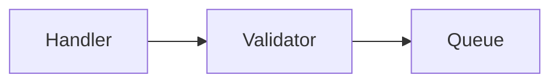

# Knowledge base format — core

The file format, in `reference/schema/`: this file, plus one per kind. Skills
load core and the kinds they write; `scripts/kb_init.sh` joins all of them into
the base's `SCHEMA.md`; `scripts/kb_check.py` enforces the shape. Why things
are this way is in `decisions.md`, not here. Where a file lives is not part of
the format: directory names in examples are illustrative.

## Identity

| Scope | ID form | Example |
|---|---|---|
| stays in the base (capture, note) | `<slug>_<n>` | `retry-wrapper_1` |
| leaves the base (a card) | 12 random base62 characters | `Xo1jycAlN4xQ` |

`<n>` is the lowest number free among items sharing the slug, whatever their
kind — **the slug pool** is one subject's items: its captures, its note, its
verify reports. Random IDs come from `scripts/kb_randomid.sh [count]`, never
invented.

The filename contains the full ID, optionally after an underscore-separated
prefix (`2026-08-10_retry-wrapper_1.md`). The ID is also in frontmatter.
`scripts/kb_find.py` finds an item by ID, a slug pool, or what refers to an
item — use it rather than guessing paths.

## Common keys

```yaml
id: retry-wrapper_2
type: Note          # Capture, Note, Recall Card
title: Retry wrapper ordering        # the subject, not a claim
origin: human                        # human | machine
generated: { by: claude-code/opus-5, at: 2026-08-10T14:35:00Z }
status: stable                       # draft | stable | deprecated | abandoned
```

- `origin` — **whose claims these are**, never inferred. `human`: the user's
  claims, whoever produced the text. `machine`: not the user's.
  **Machine-origin material never produces a card.**
- `generated` — who produced the text, and when its **claims** last changed. A
  scaffolding edit (a URL, a path, formatting) does not move `at`.
- `status` — `draft` until verified (and, for a note or card, approved);
  `deprecated` once no longer true; `abandoned` when the user decided not to
  pursue it. Never delete.
- Actors: `human:<user>` from the bearings, the agent's own model ID
  (`claude-code/opus-5`), `process:<name>`. Timestamps UTC ISO 8601:
  `date -u +%Y-%m-%dT%H:%M:%SZ`.

## `verified` and `approved`

```yaml
verified: { by: claude-code/opus-5, at: 2026-08-10T14:35:00Z }   # latest check
approved: { by: human:jan, at: 2026-08-10T14:41:00Z }             # human only
```

- `verified` — the claims were checked against evidence; the **latest** check
  only, replaced on a new one.
- `approved` — the user's: mine, worded right, worth keeping. Stamped at their
  say-so, never read out of silence. What makes an item eligible for cards.
- **Unverified means draft**, for everything (a card's `approved` stands in).
- Legacy: a `verified` list is read as its last entry; a `human:` entry in it
  as approval. `scripts/kb_migrate.py` converts both.

## `sources`

```yaml
sources:
  - resource: kb:retry-wrapper_1                 # an item in this base, by ID
  - resource: https://github.com/acme/backend    # repository, by URL
    paths: [src/queue/retry.py, src/queue/consumer.py]   # or path:
    symbol: RetryWrapper                         # optional; or symbols:
    commit: a1b2c3d                              # what it was checked against
  - resource: https://peps.python.org/pep-0492/  # document
    retrieved: 2026-08-10
```

- Every entry has `resource`. An item is `kb:<id>`, never a path: items move.
  (A legacy `/path` is still read.)
- A repository by URL, never a local path; `path` relative to its root. One
  entry per repository, `paths`/`symbols` grouped — never both forms of a key.
- `commit` / `retrieved` are written when the claim is checked; verification
  reads them later.
- **Derived items list what they came from first** — a note its captures.
  **Evidence is recorded once, where it was read**: never copied down a chain.
- Evidence is what the claims turn on — a handful of entries, not everything
  opened.
- Sources restrict derivation, not mention: naming an item in prose is free.

| Item | Sources |
|---|---|
| Capture, human | evidence only |
| Capture, machine | the item it concerns, if any, then evidence |
| Note | its captures (and notes), then evidence read beyond them |
| Card | the note or capture it is drawn from — never evidence directly |

## Machine blocks

Inside an `origin: human` note or card, agent-written material is fenced:

````markdown
<!-- machine: claude-code/opus-5, 2026-09-12, commit a1b2c3d -->

<!-- /machine -->
````

Nothing inside is carded; the file stays `origin: human`; the agent redraws a
block freely with a new stamp. What belongs inside is scaffolding for the
current state — a diagram, a walkthrough. **Never history**: a delta report is a verify report (a machine
capture). Captures need no blocks — `origin` covers the whole file.
